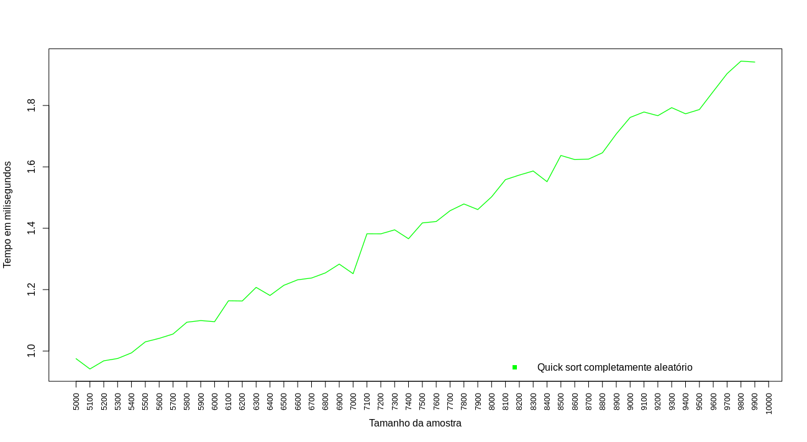

# 			Análise empírica de algoritmos de 								ordenação


## Estrutura de dados básicas I - 2019.2


## Professor 

Selan Rodrigues dos Santos


## Autores 

Tiago Onofre 

Sandra Bastos


# Relatório técnico

## Sumário

+ **Introdução**
  + **Sobre o projeto** 
  + **Requisitos para reprodução e execução dos testes**
  + **Especificações da máquina utilizada**
  + **Compilação e execução**

+ **Análise**
  + **Processando as linhas de comando**
  + **Funções Principais** 
    + `generate_array`
    + `increase_array_control`
    + `Cálculo da média aritmética progressiva`
    + `type_array `

* **Algoritmos**
* _**Quick Sort**_
  	+  _**Insertion Sort**_
  	+  **_Selection Sort_**
  	+  **_Bubble Sort_**
  	+  **_Shell Sort_**
  	+  **_Radix Sort_**
  	+  _**Quick + Insertion**_
* **Resultados**
  * **Considerações Gerais**
  * **Cenários Apropriados**
  * **Radix Sort vs Shell Sort vs Quick Sort**
  * **Quick Sort vs Merge Sort**
  * **Medições** 

## Introdução 

### Sobre o projeto

   O projeto de análise empírica tem como objetivo analisar o desempenho de um conjunto de algoritmos de ordenação baseado no seu tempo de execução e número de interações em arranjos de tamanho `n` crescente. O projeto trabalha com seis cenários de amostras: ordem completamente aleatória, ordem não decrescente, ordem não crescente, arranjo 75% ordenado, arranjo 50% ordenado e arranjo 25% ordenado.

### Requisitos para reprodução e execução dos testes

* Sistema operacional: `linux`
* Aplicação auxiliar: `cmake` 
* Compilador: `g++`
* Versionador: `git`
* Gerar gráficos: `RStudio` . Caso deseje utilizar outro método atente-se apenas a formatação dos arquivos.

### Especificações da máquina utilizada

| Componente           | Modelo                                              |
| -------------------- | --------------------------------------------------- |
| Processador          | AMD Ryzen 7 1800X, Oito Núcleos, Cache 20MB, 3.6GHz |
| Placa mãe            | ASUS EX-A320M-Gaming Socket AM4 Chipset AMD A320    |
| Memória              | Memória RAM 24GB 3000 - 3200 MHz DDR4               |
| Sistema              | Ubuntu 18.04                                        |
| Linguaguem           | C++ 11                                              |
| Versão do compilador | g++ 7.4.0                                           |


### Compilação e execução

Para baixar o código na sua máquina:

```bash
$ git clone https://github.com/OnofreTZK/Empirical_Analysis.git
```

Para compilar:

``` bash
$ cmake -S . -Bbuild
$ cd build/
$ make
```

Para executar:

```bash
$ ./ea_driver <array_max_size> <initial_sample_size> <number_of_samples> <algorithm_ID>
```

* `<array_max_size>`: Tamanho máximo da amostra. 

* `<initial_sample_size>`: Tamanho da amostra inicial.

* `<number_of_samples> `: Número de amostras

* `<algorithm_ID>`: código do algoritmo de ordenação

  + **[0]** -- _Quick Sort_ 

  + **[1]** -- _Selection Sort_

  + **[2]** -- _Insertion Sort_

  + **[3]** -- _Bubble Sort_

  + **[4]** -- _Radix Sort_

  + **[5]** -- _Shell Sort_

  + **[6]** -- _Quick + Insertion_

  + **[7]** -- _Merge Sort_

    

O programa aceita até três algoritmos para análise em uma única execução, exemplo:

```bash
$ ./ea_drive 10000 5000 50 0 1 2

```

## Análise


### Processando as linhas de comando

Após a leitura e o processamento de argumentos, todos os dados são passados para a função principal `execute_analysis` :

```c++
  // Exemplo de uma execução com 3 algoritmos.       

	std::cout << "\n>>>Starting " << data.sort_ID[algo1] << " analysis\n";
 
  execute_analysis( array[algo1], algo1, MAX, samples, init_sample, data );
 
  std::cout << "\n>>>Starting " << data.sort_ID[algo2] << " analysis\n";
 
  execute_analysis( array[algo2], algo2, MAX, samples, init_sample, data );
  
  std::cout << "\n>>>Starting " << data.sort_ID[algo3] << " analysis\n";

  execute_analysis( array[algo3], algo3, MAX, samples, init_sample, data );
  
  return EXIT_SUCCESS;
```


A partir dela os dados serão distribuidos para que o programa possa medir e guardar o que for necessário:

```c++
void execute_analysis( algorithms func, int algorithm_ID, long int max, 
                       long int samples, long int init_sample, DATA data )
{
    // Gerando um vetor completamente aleatório.
    long int * array = generate_array( max );

    // Variável para calcular a média do tempo
    //======================================================================
    double arithmetic_mean;// será utilizada a média aritmética progressiva
    //======================================================================

    data.alocate_vectors( samples );

    for( int type = 0; type < 6; type++ )
    {

        for( int iter_samples = 0; iter_samples < samples; iter_samples++)
        {

            arithmetic_mean = 0.0; // zerando a média

            for( int time_control = 0; time_control < 10; time_control++ )
            {
                type_array( array, type, data, max );

                // -- CONTADOR COMEÇA AQUI --
                std::chrono::steady_clock::time_point START = std::chrono::steady_clock::now();
                func( array, array + increase_array_control( max, samples, init_sample, iter_samples + 1 ) );
                std::chrono::steady_clock::time_point STOP = std::chrono::steady_clock::now();
                // -- CONTADOR TERMINA AQUI --

                auto timer = (STOP - START);

                //Cálculo da média progressiva.
                arithmetic_mean = arithmetic_mean + ( ( std::chrono::duration< double, std::milli > (timer).count() - arithmetic_mean )/(time_control+1) );

            }
            // Aloca de acordo com o número de amostras.
            long int sample = increase_array_control( max, samples, init_sample, iter_samples + 1 );

            // Guarda os valores para gerar o arquivo.
            data.set_values( sample, arithmetic_mean, iter_samples );
        }

        // Cria o arquivo.
        create_data_file( data, algorithm_ID, type );

    }

    delete[] array; // libera a memória.
}
```


### Funções principais

* **`generate_array`**

```c++ 
//=======================================================================================
// aloca e preenche o vetor com números em um intervalo de [0, <array_max_size>) 
//=======================================================================================
long int generate_numbers( long int range )
{
      std::random_device seed;

      std::mt19937_64 gen( seed() );
      // aleatoriedade com probabilidade linear.
      std::uniform_int_distribution<long int> distr(0, range); 

      return distr( gen );
}


long int * generate_array( long int max )
{
  	// alocação utilizando a entrada do usuário.
    long int * array = new long int [max];

    for ( int i = 0; i < max; i++ )
    {
        array[i] = generate_numbers(max); 
    }

    return array;
}
//====================================================================================
```

+ **`increase_array_control`**

```c++
//====================================================================================
// Crescimento linear das amostras utilizando P.A. ( <init_sample>, <array_max_size> )
//====================================================================================
long int increase_array_control( long int max, long int samples, long int init_sample, int index )
{
    //calculando o 'r'( razão) progressão aritmética.
    long int reason = ( max - init_sample )/ samples;

    return init_sample + (( index - 1 ) * reason);

}
//====================================================================================
```

O método de crescimento da `amostra inicial`  ao `tamanho máximo` é linear

  Fórmula :

​                    $amostra_{n}$ = $amostra_{1}$ $+$ $(n -1)reason$ 


 `n` = índice da amostra.


`reason` =  $\frac{amostra_{m} - amostra_{0}}S$

`S` = número de amostras.


+ **Cálculo da média aritmética progressiva**

```c++
arithmetic_mean = arithmetic_mean + ( ( std::chrono::duration< double, std::milli > (timer).count() - arithmetic_mean )/(time_control+1) );
```

Buscando o máximo de precisão cada amostra é analisada 10 vezes e o tempo guardado é a média de todas as execuções. Com o intuito de evitar erros de arredondamento o programa utiliza a seguinte fórmula:

​                    

$M_{k}$ =  $M_{k-1}$ $+$ $\frac{x_{k} - M_{k-1}}k$ 


+ **`type_array`** 

 ```c++
//==========================================================================
// Seleciona baseado no laço qual amostra deve ser gerada para análise.
//==========================================================================
void type_array( long int * array ,int type, DATA data, long int max )
{

        switch( type )
        {
            case 0 :
                std::cout << "\nTEST " << type+1 << " -- " << data.typesample[type] << "\n";
                random_array( array, array + max, max );
                break;
            case 1 :
                std::cout << "\nTEST " << type+1 << " -- " << data.typesample[type] << "\n";
                ascending_sorting( array, array + max );
                break;
            case 2 :
                std::cout << "\nTEST " << type+1 << " -- " << data.typesample[type] << "\n";
                descending_sorting( array, array + max );
                break;
            case 3 :
                std::cout << "\nTEST " << type+1 << " -- " << data.typesample[type] << "\n";
                ascending_sorting( array, array + max );
                partial_sorting( array, array + max, 25 );
                break;
            case 4 :
                std::cout << "\nTEST " << type+1 << " -- " << data.typesample[type] << "\n";
                ascending_sorting( array, array + max );
                partial_sorting( array, array + max, 50);
                break;
            case 5 :
                std::cout << "\nTEST " << type+1 << " -- " << data.typesample[type] << "\n";
                ascending_sorting( array, array + max );
                partial_sorting( array, array + max, 75 );
                break;
            default:
                std::cout << "\nHow?\n";
                break;
        }
}
//==========================================================================
 ```


## Algoritmos


### Quick Sort

* É o método de ordenação interna mais rápido que se conhece para uma ampla variedade de situações.

* Complexidade no pior caso: $O(n²)$ 

* Complexidade no melhor e médio caso: $O(n log n)$ 

* Não é estável.

* Estratégia:  **_dividir e conquistar_**

* Funcionamento:

  ```
  procedimento QuickSort(X[], IniVet, FimVet)
  var
   i, j, pivo, aux
  início
     i <- IniVet
     j <- FimVet
     pivo <- X[(IniVet + FimVet) div 2]
     enquanto(i <= j)
      |      enquanto (X[i] < pivo) faça
      |       |   i <- i + 1
      |      fimEnquanto
      |      enquanto (X[j] > pivo) faça
      |       |   j <- j - 1
      |      fimEnquanto
      |      se (i <= j) então
      |       |   aux  <- X[i]
      |       |   X[i] <- X[j]
      |       |   X[j] <- aux
      |       |   i <- i + 1
      |       |   j <- j - 1
      |      fimSe
     fimEnquanto
     se (IniVet < j) então
      |  QuickSort(X, IniVet, j)
     fimSe
     se (i < FimVet) então
      |  QuickSort(X, i, FimVet)
     fimse
  fimprocedimento
  ```


##### Gráficos:

`Cenário`: _Arranjo completamente aleatório_



Os picos representam os momentos em que as amostras tendem ao pior caso, porém a eficiência do algoritmo é excelente em um arranjo sem ordem total.


`Cenário`:  _Arranjo em ordem não decrescente_


Aqui temos um exemplo de pior caso demonstrado com o pivô igual a `last - 1` e todos os elementos menores à sua esquerda. Com a limitação da máquina não foi possível analisar amostras muito maiores para melhor visualização da curva da parábola. 


`Cenário`:  _Arranjo em ordem não crescente_


Assim como o gráfico anterior, esse demonstra outro exemplo de pior caso com o pivô igual a `first`  e todos os elementos maiores à sua direita.


`Cenário`:  _Arranjo 75% ordenado_


`Cenário`:  _Arranjo 50% ordenado_ 


`Cenário`:  _Arranjo 25% ordenado_


`Comparação`:  _Arranjos parcialmente ordenados_


Pela observação comparativa dos gráficos há uma queda de desempenho do algoritmo quando a divisão do vetor é desbalanceada( pivô tendendo as pontas ), com isso pode-se concluir que o quick sort não é a melhor opção para arranjos parcialmente ordenados. A quantidade passos é a mesma.


### Insertion Sort

* Ordenação por inserção 

* Percorre um vetor de elementos da esquerda para a direita e à medida que avança vai ordenando os elementos à esquerda

* Complexidade no melhor caso:  $ O(n)$

* Complexidade no pior caso: $ O(n²) $ 

*  Método de ordenação estável.

* Funcionamento:

  ```
  FUNÇÃO INSERTION_SORT (A[], tamanho)
          VARIÁVEIS
                  i, j, eleito
          PARA i <- 1 ATÉ (tamanho-1) FAÇA
                  eleito <- A[i];
                  j <- i-1;
                  ENQUANTO ((j>=0) E (eleito < A[j])) FAÇA
                            A[j+1]:= A[j];
  # Elemento de lista numerada
                            j:=j-1;
                  FIM_ENQUANTO
                  A[j+1] <- eleito;
          FIM_PARA
  FIM
  ```

   

**Gráficos** :


`Cenário`:  _Arranjo completamente aleatório_


Em um arranjo não ordenado o algoritmo não tem uma boa eficiência e deve ser evitado para amostras muito grandes. 


`Cenário`:  _Arranjo em ordem não decrescente_


Visualização do insertion sort no seu melhor caso com o gráfico praticamente linear. Os picos se devem a variação de desempenho da máquina uma vez que o arranjo não possui repetição aumentando o número de interações.

`Cenário`: _Arranjo em ordem não crescente_


Visualização do pior caso, onde o algoritmo inverte completamente o vetor e sua complexidade é inevitavelmente quadrática.

`Cenário`:  _Arranjo 75% ordenado_


`Cenário`: _Arranjo 50% ordenado_


`Cenário`: _Arranjo 25% ordenado_


`Comparação`: _Arranjo parcialmente ordenado_ 


O melhor cenário para o insertion é um arranjo com ordem parcial tendendo a ordem total. Fica clara a redução e/ou inexistência de picos no tempo de execução quanto mais ordenado estiver o vetor. A quantidade de passos é mutável.


### Selection Sort

* Ordenação por seleção: seleciona o menor item e coloca na primeira posição, seleciona o segundo menor item e coloca na segunda posição, segue estes passos até que reste um único elemento. 

* Complexidade em todos os casos: $O(n²)$ 

* Não é estável.

* Funcionamento:

  ```
   var i,j,aux,menor : INTEIRO
   PARA i=0 ATE (vet.tamanho-1) PASSO 1
    menor = i
    PARA j=i+1 ATE vet.tamanho PASSO 1
     SE (vet[menor] > vet[j]) ENTAO
      menor = j
      FIMSE
      FIMPARA
     SE (menor != i) ENTAO
      aux = vet[menor]
      vet[menor] = vet[i]
      vet[i] = aux
    FIMSE
   FIMPARA
  ```


`Cenário`: _Arranjo completamente aleatório_ 


`Cenário`: _Arranjo em ordem não decrescente_


`Cenário`: _Arranjo em ordem não crescente_ 


`Cenário`: _Arranjo 75% ordenado_ 


`Cenário`: _Arranjo 50% ordenado_ 


`Cenário`: _Arranjo 50% ordenado_


`Comparação`: _Arranjo parcialmente ordenado_ 


O selection sort tem como única vantagem a sua implementação simples. Todos os gráficos possuem praticamente o mesmo tempo de execução nos 6 cenários apresentados, isso se deve ao fato de que antes de fazer qualquer troca, o algoritmo realiza uma busca sequencial( $O(n-i)$ ) para cada posição do vetor, tornando-o ineficiente. A quantidade de passos é sempre a mesma.


### Bubble Sort

* Ordenação por flutuação: a ideia é percorrer o arranjo diversas vezes, e a cada passagem fazer "flutuar" para o topo o maior elemento da sequência.

* Complexidade no melhor caso: $O(n)$

* Complexidade no pior caso: $O(n²)$

* Funcionamento:

  ```
  procedure bubbleSort( A : lista de itens ordenaveis ) defined as:
    do
      trocado := false
      for each i in 0 to length( A ) - 2 do:
        // verificar se os elementos estão na ordem certa
        if A[ i ] > A[ i + 1 ] then
          // trocar elementos de lugar
          trocar( A[ i ], A[ i + 1 ] )
          trocado := true
        end if
      end for
    // enquanto houver elementos sendo reordenados.
    while trocado
  end procedure
  ```


`Cenário`: _Arranjo completamente aleatório_


`Cenário`: _Arranjo em ordem não decrescente_ 


semelhante ao insertion, o bubble opera melhor em arranjos que tendem a ordem total.

`Cenário`: _Arranjo em ordem não crescente_ 


`Cenário`: _Arranjo 75% ordenado_ 


`Cenário`:  _Arranjo 50% ordenado_


`Cenário`: _Arranjo 25% ordenado_  


`Comparação`: _Arranjo parcialmente ordenado_ 


O número de passos é o mesmo para arranjos de ordem parcial.


### Shell Sort

* O método Shell: é uma extensão do algoritmo de ordenação por inserção. Ele permite a troca de posições distantes ums das outras, diferente do insertion sort que possui a troca de itens adjacentes para determinar o ponto de inserção. 

* A complexidade do algoritmo é **desconhecida**, ninguém ainda foi capaz de encontrar uma fórmula fechada. 

* O método não é estável.

* Os itens separados de `h`posições (itens distantes) são ordenados: o elemento na posição `x`é comparado e trocado (caso satisfaça a condição de ordenação) com o elemento na posição `x-h`. Este processo repete até `h=1`, quando esta condição é satisfeita o algoritmo é equivalente ao método de inserção.

* Funcionamento:

  ```
  // Algoritmo de ordeção ShellSort
      public static void ordenaçãoShell(int[] v) {
          final int N = v.length;
          int incremento = N;
          do {
              incremento = incremento / 2;
              for (int k = 0; k < incremento; k++) {
                  for (int i = incremento + k; i < N; i += incremento) {
                      int j = i;
                      while (j - incremento >= 0 && v[j] < v[j - incremento]) {
                          int tmp = v[j];
                          v[j] = v[j - incremento];
                          v[j - incremento] = tmp;
                          j -= incremento;
                      }
                  }
              }
          } while (incremento > 1);
      }
  ```

  


`Cenário`: _Arranjo completamente aleatório_


O melhor resultado nas análises foi em um arranjo sem ordem total, quando operado em alguma ordem parcial os resultados fogem do "padrão" dos algoritmos de ordenação. 


`Cenário`:  _Arranjo em ordem não decrescente_


pico inesperado.


`Cenário`: _Arranjo em ordem não crescente_


`Cenário`: _Arranjo 75% ordenado_


`Cenário`:  _Arranjo 50% ordenado_


`Cenário`: _Arranjo 25% ordenado_


`Comparação`: _Arranjo parcialmente ordenado_


Vale em comum na amostra de tamanho `8100` 


### Radix Sort

* Rápido e estável

* Pode ser usado para ordenar itens que estão identificados por chaves únicas. Cada chave é uma cadeia de caracteres ou números.

* Ordena as chaves em qualquer ordem relacionada com a lexicografia

* Complexidade : $O(w * n)$  onde é o número de bits para guardar na chave.

* Radix sort é um algoritmo que ordena inteiros processando dígitos individuais.  __Como os inteiros podem representar strings compostas de caracteres (como nomes ou datas) e pontos flutuantes especialmente formatados, radix sort não é limitado somente a inteiros.__

* A versão implementada neste projeto é a LSD - ( Least significant digit ).

* O radix sort LSD começa do dígito menos significativo até o mais significativo, ordenando tipicamente da seguinte forma: chaves curtas vem antes de chaves longas, e chaves de mesmo tamanho são ordenadas lexicograficamente. **Isso coincide com a ordem normal de representação dos inteiros**, como a sequência "1, 2, 3, 4, 5, 6, 7, 8, 9, 10". Os valores processados pelo algoritmo de ordenação são frequentemente chamados de “chaves”, que podem existir por si próprias ou associadas a outros dados. As chaves podem ser strings de caracteres ou números.

* Funcionamento:

  ```
  long int getMax( long int * first, long int * last, long int &count )
  {
      long int maximum = *first;
  
      while( first < last )
      {
          if( maximum < *first )
          {
              maximum = *first;
              count++; // if
          }
          first++;
          count += 2; // while and increment.
      }
  
      return maximum;
  }
  
  void countingSort( long int * first, long int * last, long int digit, long int &count )
  {
      long int size = std::distance( first, last );
  
      long int * output = new long int [size];
  
      long int cnt[10] = { 0 };
  
      long int * left = first;
  
      cnt[0] = 0;
  
      for( int i = 0; i < size; i++ )
      {
          cnt[ (*left/digit)%10 ]++;
          left++;
          count += 3; // increments and loop.
  
      }
  
      for( int i = 1; i < 10; i++ )
      {
          cnt[i] += cnt[i -1];
          count++;
      }
  
      left = last;
  
      for( int i = size - 1; i >= 0; i-- )
      {
          left--;
          output[ cnt[ (*left/digit)%10 ] - 1 ] = *left;
          cnt[ (*left/digit)%10 ]--;
          count += 3;
  
      }
  
      left = first;
  
      for( int i = 0; i < size; i++ )
      {
          *left = output[i];
          left++;
          count += 2;
      }
  
      delete[] output;
  
  }
  
  void radix( long int * first, long int * last, long int &count )
  {
      long int maximum = getMax( first, last, count );
  
      for( long int digit = 1; maximum/digit > 0; digit *= 10 )
      {
          countingSort( first, last, digit, count );
          count++;
      }
  
  }
  
  ```


`Cenário`: _Arranjo completamente aleatório_


O numero de passos irá depender diretamente da quantidade de digitos do maior elemento.


`Cenário`: _Arranjo em ordem não decrescente_


`Cenário`: _Arranjo 75% ordenado_


`Cenário`: _Arranjo 50% ordenado_


`Cenário`: _Arranjo 25% ordenado_


`Comparação`: _Arranjo parcialmente ordenado_


A eficiência do radix independe do cenário e do tamanho da amostra, visto que nenhuma medida do tempo de execução alcançou 1 ms.


### Quick + Insertion 

* O insertion é utilizado nas camadas mais baixas da recursão do quick quando o intervalo entre `first` e `last` é pequeno.

* Funcionamento:

  ````
  void variable( long int * first, long int * last, long int &count )
  {
  
      if( first == last )
      {
          count++; // if.
          return;
      }
      
      // inserindo o insertion em segmentos parcialmente ja ordenados pelo partition.
      if( std::distance( first, last ) < 9 )
      {
          count++; // if
          insertion( first, last, count ); 
      }
  
      long int * pivot = partition( first, last, last - 1, count );
      variable( first, pivot, count);
      variable( pivot + 1, last, count );
  
  }
  ````


`Cenário`: _Arranjo completamente aleatório_


`Cenário`: _Arranjo em ordem não decrescente_


`Cenário`: _Arranjo em ordem não crescente_


`Cenário`: _Arranjo 75% ordenado_


`Cenário`: _Arranjo 50% ordenado_


`Cenário`: _Arranjo 25% ordenado_


`Comparação`: _Arranjo parcialmente ordenado_


Os passos do variante serão praticamente os mesmos do quick visto que a quantidade de passos do insertion em ordens parciais é a mesma( no variante operamos a inserção em pequenos vetores já semi ordenados). 


## Resultados


### Considerações gerais

As primeira constatação foi perceber uma relação entre a facilidade de implementação e a eficiência do algoritmo:

Fácil implementação e pouca eficiência em grandes amostras não ordenadas:

+  Bubble Sort
+ Insertion Sort
+ Selection Sort

Implementação complexa e boa eficiência em grandes amostras não ordenadas:

* Radix Sort
* Shell Sort

Isso pode ser levando em consideração para "desbancar" o uso do radix em qualquer cenário, pois mesmo  pelo seu excelente desempenho, sua dificuldade até mesmo para entender o funcionamento faz com que optar por outro mais simples( merge, quick) seja a melhor escolha.

Pela observação dos gráficos o uso de alguns algoritmos de alto desempenho depende completamente do cenário em que ele será aplicado, como o quick sort que em um arranjo que apresente ordem parcial terá aumento considerável no tempo de execução.


### Cenários apropriados

+ Quick Sort e Quick + Insertion combo

  ​	Eficiente em arranjos sem ordem total.

  

+ Insertion Sort

  ​	Deve ter seu uso evitado quando sozinho em amostras muito grandes e sem ordem total, seu melhor desempenho é em vetores parcialmente ordenados.

  

+ Selection Sort e Bubble Sort

    Pouca eficiência mesmo quando utilizados em arranjos com ordem parcial. Apresentaram os piores tempo de execução no geral.

  

  

O insertion sort opera pior que o selection sort quando não há ordem total. 


+ Shell Sort

  Extremamente eficiente em um vetor sem ordem total e apesar da queda de desempenho em arranjos com ordem parcial, pode ser utilizado em diversos cenários.

  

+ Radix Sort

  Excelente em **qualquer** cenário.


### Radix Sort vs Shell Sort vs Quick Sort

Apesar da vantagem do radix em todos os cenários, o alto desempenho do shell para um algoritmo de comparação e inserção é excelente. O quick sort consegue concorrer com o radix se o cenário considerado for o de um arranjo sem ordem total e ocorrência tender ao melhor caso.

No que diz respeito as comparações realizadas, pode-se dizer que o algoritmo mais eficiente é o radix.


### Quick Sort vs Merge Sort

1. **Memória**: O merge sort faz uso de memória extra, já o quicksort requer pouco espaço. O quick sort é um algoritmo de ordenação  interna, isto é, não é necessário espaço de armazenamento adicional para ordenar. o merge sort requer uma alocação temporária para juntar as divisões ordenadas, entregando a vantagem para o quick sort no quesito memória.
2. **Pior caso**: O pior caso do quicksort é evitável usando o quicksort aleatório ou escolhendo o pivô certo. Indo além e buscando uma ocorrência de caso médio melhora o desempenho e se torna tão eficiente quanto o merge sort.
3. **Estabilidade**: O merge sort tem estabilidade nas trocas, o quick sort não.
4. **Conclusão**: Se o(a) programador(a) tiver a capacidade de otimizar para automatizar a busca pelo caso médio o quick sort é mais recomendável que o merge.


### Medições

O método utilizado para executar as análises impossibilitou o uso de amostras grandiosas. Uma amostra de tamanho 100.000 poderia passar até 14 horas rodando.

Não houveram coisas estranhas nas medições além de alguns picos decorrentes, provavelmente, do processamento da máquina utilizada.


### N = 500 Bilhões 


Algoritmos quadraticos levariam **`500²e+09 segundospara ordenar


Algoritmos de complexidade $n(logn)$ levariam **`500e+09log500e+09 segundos`** para ordernar


Não é possível estimar com precisão quanto tempo o Shell sort ordenaria mas seria aproximadamente entre  **`500²e+09 segundos`**    e    **`500e+09log500e+09 segundos`**  


O Radix sort ordenaria em **`w * 500²e+09 segundos  `** 


### Quick vs Quick Combo 


O Quick combo se mostrou pior em todos os cenários analisados.

